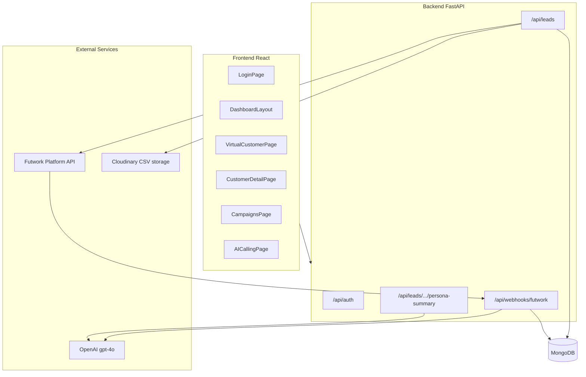
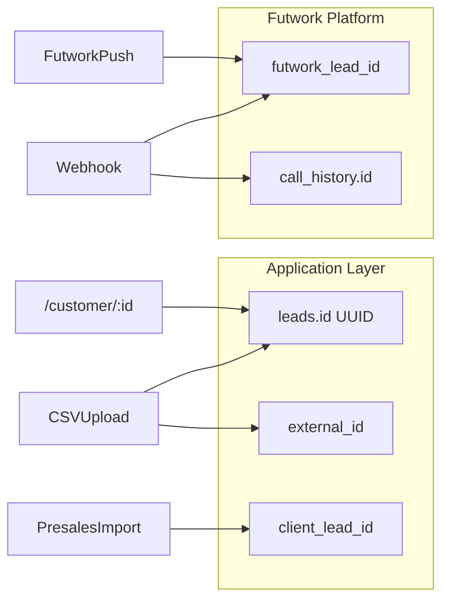
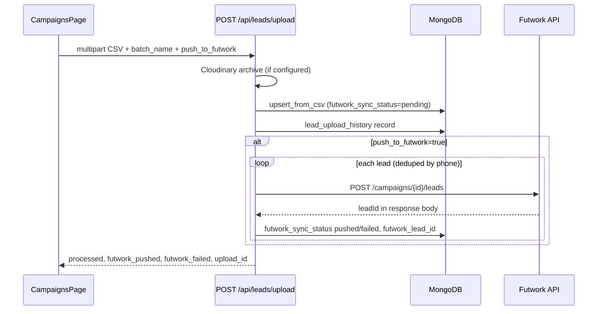
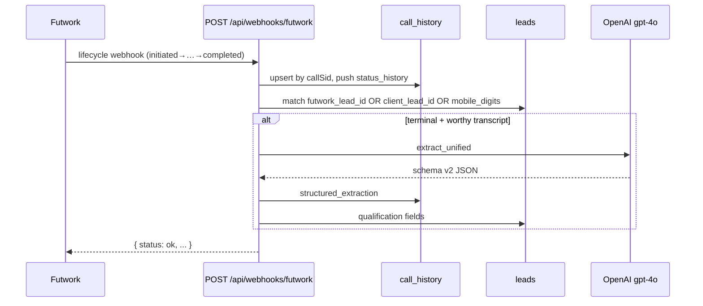

# Rustomjee Sales Intelligence — Application Audit Report

**Generated:** May 2026  
**Scope:** [`frontend/`](frontend/) (React) + [`backend/`](backend/) (FastAPI / MongoDB)  
**Purpose:** Document current project state, database schema, Futwork telephony integration, lead identity model, and AI features.

---

## Table of Contents

1. [Executive Summary](#1-executive-summary)
2. [System Architecture](#2-system-architecture)
3. [Environment & Deployment](#3-environment--deployment)
4. [Database Schema (MongoDB)](#4-database-schema-mongodb)
5. [Lead Identity Model](#5-lead-identity-model)
6. [Futwork Integration](#6-futwork-integration)
7. [AI Features](#7-ai-features)
8. [API Route Inventory](#8-api-route-inventory)
9. [Frontend Audit](#9-frontend-audit)
10. [Auth & RBAC](#10-auth--rbac)
11. [Scripts & Data Migration](#11-scripts--data-migration)
12. [Security & Operational Notes](#12-security--operational-notes)
13. [Known Gaps & Recommendations](#13-known-gaps--recommendations)
14. [Appendix A — CSV Column Mappings](#appendix-a--csv-column-mappings)

---

## 1. Executive Summary

### What this application is

**Rustomjee Sales Intelligence** is a presales CRM and analytics dashboard for Rustomjee Developers. It ingests leads from CSV uploads and presales dumps, pushes them to **Futwork** for AI outbound calling (voice agent “प्रिया”), receives call lifecycle webhooks, stores transcripts and recordings, and surfaces AI-generated buyer insights to sales teams.

### Current project state

| Layer | Technology | Maturity |
|-------|------------|----------|
| **Frontend** | CRA + Craco, React 19, React Router 7, Axios, Tailwind, Recharts, TanStack Virtual | Feature-rich UI; Settings page is placeholder only |
| **Backend** | FastAPI, Motor (async MongoDB), Pydantic | Production-oriented; no SQL/ORM |
| **Database** | MongoDB (`rustomjee_db` default) | Document store with explicit indexes |
| **Telephony** | Futwork `platform.futwork.ai` | Push API + webhooks + optional call-report CSV |
| **AI** | OpenAI `gpt-4o` | Persona, strategic moves, structured call extraction |

**Repository status:** Large uncommitted working tree (auth, RBAC, marketing/analytics dashboards, presales import scripts, layout refactor). Treat as **active development**, not a frozen release tag.

### User roles

| Role | Capabilities |
|------|----------------|
| `admin` | Org dashboard, campaigns, lead assignment, sales/marketing dashboards, all leads |
| `sales` | My Dashboard (assigned leads only), Virtual Customer (scoped), AI Calling, notifications |

Default users are seeded from [`backend/seed_users.json`](backend/seed_users.json) on database init.

---

## 2. System Architecture



### Entry points

| Component | File | Notes |
|-----------|------|-------|
| Backend API | [`backend/main.py`](backend/main.py) | FastAPI app, CORS `*`, startup connects Mongo + indexes |
| Frontend SPA | [`frontend/src/App.js`](frontend/src/App.js) | `AuthProvider`, route guards, `DashboardLayout` shell |
| API client | [`frontend/src/lib/api.js`](frontend/src/lib/api.js) | Axios, 120s timeout, JWT refresh on 401 |

### Middleware

- **CORS:** `allow_origins=["*"]` on all routes (development-friendly; tighten for production).
- **Auth:** Per-route `Depends(get_current_user)` — not global middleware.
- **Webhooks:** No JWT; optional `FUTWORK_WEBHOOK_SECRET` header check.

---

## 3. Environment & Deployment

### Backend (`.env` in `backend/`)

| Variable | Required | Purpose |
|----------|----------|---------|
| `MONGO_URL` | Yes | MongoDB connection string |
| `DB_NAME` | No (default `rustomjee_db`) | Database name |
| `SECRET_KEY` | Yes (prod) | JWT signing; default exists in code — **change in production** |
| `ACCESS_TOKEN_EXPIRE_MINUTES` | No (30) | Access token TTL |
| `REFRESH_TOKEN_EXPIRE_DAYS` | No (7) | Refresh token TTL |
| `FUTWORK_API_KEY` | For push | Outbound lead push to Futwork |
| `FUTWORK_CAMPAIGN_ID` | For push | Campaign ID in Futwork URL path |
| `FUTWORK_WEBHOOK_SECRET` | Strongly recommended | Webhook authentication |
| `FUTWORK_AGENT_ID` | Optional | Reference only (agent configured on Futwork platform) |
| `FUTWORK_MAX_ATTEMPTS` | Optional | Display on campaign card |
| `FUTWORK_CALL_RATE_LIMIT` | Optional | Display on campaign card |
| `OPENAI_API_KEY` | For AI | Persona, extraction, summaries (`EMERGENT_LLM_KEY` fallback) |
| `CLOUDINARY_URL` | For CSV upload | Archives original upload CSV |
| `LEAD_UPLOAD_MAX_BYTES` | No (10 MiB) | Max CSV upload size |

### Frontend

| Variable | Required | Purpose |
|----------|----------|---------|
| `REACT_APP_BACKEND_URL` | Yes (Campaigns page enforces) | Backend root URL, e.g. `http://localhost:8000` |

Without `REACT_APP_BACKEND_URL`, `getApiBase()` falls back to `/api` (requires a dev proxy).

### Run commands

```bash
# Backend
cd backend && uvicorn main:app --reload --port 8000

# Frontend
cd frontend && npm start   # craco start, port 3000
```

---

## 4. Database Schema (MongoDB)

There is **no relational schema**. Persistence uses MongoDB documents. [`LeadDetail`](backend/app/models/lead.py) is a Pydantic model for API validation with `extra = "allow"` so additional Mongo fields are permitted.

### 4.1 Collection: `leads`

**Primary key:** `id` (UUID string, unique index) — used by all frontend routes (`/customer/:id`) and authenticated APIs (`/api/leads/{lead_id}`).

#### Indexes ([`backend/app/core/database.py`](backend/app/core/database.py))

| Index | Type | Purpose |
|-------|------|---------|
| `id` | unique | Primary lookup |
| `mobile_digits` | unique (best-effort) | Phone dedup; may fail if duplicates exist |
| `mobile` | — | Search |
| `_seed_key` | — | CSV upload dedup |
| `futwork_lead_id` | — | Webhook correlation |
| `client_lead_id` | unique, sparse | Presales import |
| `phone_key` | — | Country code + mobile composite |
| `campaign_id` | — | Campaign filter |
| `(campaign_id, futwork_sync_status)` | compound | Retry failed pushes |
| `budget_category`, `location_category`, `temperature`, `qualification_category`, `intent_category`, `project`, `is_vip` | — | Virtual Customer filters |
| `(field, updated_at)` | compound | Filter + sort |
| `assigned_user_id`, `upload_batch_id`, `disposition`, `sales_qualification` | — | Scoping / filters |
| `(full_name, mobile, project)` | text | Full-text search |

#### Field groups

| Group | Key fields |
|-------|------------|
| **Identity** | `id`, `full_name`, `mobile`, `mobile_digits`, `email`, `project`, `location`, `source`, `status`, `temperature` |
| **Segmentation** | `budget`, `budget_category`, `location_category`, `intent_category`, `is_vip`, `is_hni`, `vip_category` |
| **CRM context** | `configuration`, `current_residence_type`, `current_residence_location`, `current_residential_location` (alias), `possession_requirement`, `reason_for_purchase`, `presales_description`, `context_summary`, `suggested_next_project`, `next_action_date`, `designation`, `ethnicity`, `carpet_area`, `bhk`, `first_name`, `last_name`, `last_interaction` |
| **Correlation IDs** | `external_id`, `client_lead_id`, `futwork_lead_id` — see [§5](#5-lead-identity-model) |
| **Futwork lifecycle** | `futwork_sync_status`: `pending` \| `pushed` \| `failed` |
| **AI cache** | `aiPersonaSummary`, `strategicNextMove`, `lastCallSummary` |
| **AI qualification** | `budget_match`, `area_match`, `timeline_match`, `qualification_category` |
| **Assignment** | `assigned_user_id`, `assigned_to`, `assigned_to_name`, `assigned_at` |
| **Upload batch** | `upload_batch_id`, `upload_batch_name` (internal batch UUID/name, not Futwork campaign) |
| **Call snapshot** | `disposition`, `transcript`, `last_call_date`, `last_call_status`, `last_call_status_raw`, `last_call_duration`, `last_recording_url`, `last_structured_call_sid` |
| **Sales qualification** | `sales_qualification`, `sales_qualified_at`, `sales_qualified_by` |
| **Dedup** | `_seed_key` — SHA256(`name` + `mobile` + `project`) |
| **Presales import** | `country`, `country_code`, `phone_key`, `presales_agent_name`, `presales_status` |
| **Baselines** | `baseline_budget`, `baseline_location`, `baseline_configuration`, `baseline_source`, `baseline_uploaded_at` |
| **Timestamps** | `created_at`, `updated_at` |

### 4.2 Collection: `call_history`

**Primary key:** `id` = Futwork **`callSid`** (not the internal lead UUID).

| Field | Description |
|-------|-------------|
| `id`, `call_sid` | Futwork call SID |
| `lead_id` | Futwork `leadId` from webhook/CSV — **often NOT `leads.id`** |
| `mobile_digits`, `phone`, `customer_name` | Contact info |
| `status` | Normalized status (snake-friendly) |
| `futwork_status` | Raw Futwork status string |
| `transcript`, `recording_url`, `duration`, `disposition` | Call content |
| `structured_extraction` | OpenAI schema v2 JSON object |
| `ai_disposition`, `ai_worthy` | AI-derived disposition / gate result |
| `extracted_data` | Futwork-provided extraction from CSV (not AI) |
| `status_history[]` | `{ status, at }` audit trail per webhook |
| `campaign_id`, `campaign`, `agent_id` | Campaign linkage |
| `upload_batch_id` | Optional batch tag |
| `provider`, `provider_call_id`, `from_number`, `to_number`, `direction`, `hangup_by`, `hangup_reason`, `dropoff` | Telephony metadata |
| `created_at`, `updated_at`, `provider_updated_at`, `lead_uploaded_on` | Timestamps |

### 4.3 Other collections

| Collection | Purpose | Key fields |
|------------|---------|------------|
| `users` | Authentication | `id`, `email`, `password_hash`, `full_name`, `role`, `is_active`, `current_session_id`, `created_at` |
| `campaigns` | Campaign dashboard | `id`, `name`, `futwork_campaign_id`, `agent_id`, `live_status` (completed/busy/no_answer/…), `dispositions` (interested/semiInterested/…), `total_leads`, `pickup_rate`, `status` |
| `lead_upload_history` | CSV upload audit | `id`, `filename`, `batch_name`, `processed`, `new_leads`, `updated_leads`, `unprocessed`, `futwork_pushed`, `futwork_failed`, Cloudinary URLs |
| `lead_upload_failures` | Failed CSV rows | `upload_id`, `row_index`, `reason`, `raw` |
| `marketing_spends` | Marketing dashboard | `id`, `channel`, `project`, `amount`, `leads`, `conversions`, `period`, `campaign`, `impressions`, `clicks`, `notes` |
| `notifications` | User notifications | `id`, `type`, `severity`, `title`, `message`, `lead_id`, `is_read`, `created_at` |
| `tasks` | Task tracking | `id`, `status`, `due_date`, … |
| `agents` | AI agent definitions | `id`, `name`, `description`, `prompt`, `color` |

---

## 5. Lead Identity Model

The system uses **multiple identifiers**. Confusion typically arises between **`leads.id`** (app UUID) and **`futwork_lead_id`** / **`call_history.lead_id`** (Futwork platform IDs).



### Identifier reference

| ID | Collection | Set when | Used for |
|----|------------|----------|----------|
| **`leads.id`** | `leads` | UUID on new CSV insert; UUID on webhook `$setOnInsert` if lead missing | All authenticated APIs, frontend navigation, AI persona endpoints |
| **`futwork_lead_id`** | `leads` | Futwork push response; webhook `leadId`; call-report CSV | Webhook lookup `$or: [{futwork_lead_id}, {mobile_digits}]` |
| **`call_history.lead_id`** | `call_history` | Webhook `leadId`; CSV `contextDetails_recipientData_leadId` | AI Calling filters; **equals Futwork ID, not `leads.id`** |
| **`client_lead_id`** | `leads` | Presales CSV column `Lead Id` | Sparse unique index; presales dedup |
| **`external_id`** | `leads` | CSV `unique_identifier` / `Unique Identifier` | External CRM correlation |
| **`call_history.id`** | `call_history` | Webhook `callSid` | Call dedup, call summary by `call_sid` |

### Dedup rules

| Flow | Dedup key |
|------|-----------|
| Standard CSV upload | `_seed_key` = SHA256(name + mobile + project) |
| Presales import | `client_lead_id` (unique sparse) |
| Phone | `mobile_digits` (10-digit India normalization) |
| Futwork push | Last 10 digits of phone (in-memory dedupe before HTTP) |

### Default list filter

[`leads.py`](backend/app/api/v1/leads.py) excludes `futwork_sync_status: failed` unless the client passes `futwork_sync_status` explicitly. Failed pushes are hidden from Virtual Customer by default.

---

## 6. Futwork Integration

Futwork provides AI outbound telephony. This application **pushes leads**, **receives webhooks**, and optionally **imports call-report CSVs**.

### 6.1 Outbound flow: CSV upload → MongoDB → Futwork push



**UI:** [`frontend/src/pages/CampaignsPage.jsx`](frontend/src/pages/CampaignsPage.jsx), [`UploadLeadsModal.jsx`](frontend/src/components/UploadLeadsModal.jsx)  
**API:** `POST /api/leads/upload` — [`backend/app/api/v1/leads.py`](backend/app/api/v1/leads.py)

#### Upload request (application)

```http
POST /api/leads/upload
Authorization: Bearer {access_token}
Content-Type: multipart/form-data
```

| Part / query | Type | Default | Description |
|--------------|------|---------|-------------|
| `file` | file | required | `.csv` only, max `LEAD_UPLOAD_MAX_BYTES` |
| `batch_name` | query | filename stem | Human-readable batch label |
| `push_to_futwork` | query | `true` | Push to Futwork after Mongo upsert |

#### Upload response (application)

```json
{
  "upload_id": "uuid",
  "batch_name": "My Batch",
  "processed": 120,
  "new": 80,
  "updated": 40,
  "unprocessed": 2,
  "futwork_pushed": 118,
  "futwork_failed": 2,
  "original_csv_secure_url": "https://res.cloudinary.com/..."
}
```

Failed rows are stored in `lead_upload_failures` and downloadable via campaign upload-history endpoints.

#### Futwork push request (per lead)

```http
POST https://platform.futwork.ai/api/campaigns/{FUTWORK_CAMPAIGN_ID}/leads
x-api-key: {FUTWORK_API_KEY}
Content-Type: application/json
```

```json
{
  "recipientPhoneNumber": "9821599975",
  "recipientData": {
    "customer_name": "Rishika"
  }
}
```

- One HTTP POST per lead (Futwork does not accept batch arrays).
- Phone normalized to last 10 digits.
- Name from `customer_name` or `full_name` or `"Unknown"`.

#### Futwork push response (handled flexibly)

Response body shape is not fully documented by Futwork. The app parses via `_extract_futwork_lead_id`:

```python
# Accepted top-level keys: leadId, lead_id, id, _id
# Or nested under: data, lead, result
```

On HTTP success:

- `futwork_sync_status` → `pushed`
- `futwork_lead_id` → extracted ID (if present)

On HTTP error or invalid phone:

- `futwork_sync_status` → `failed`

#### Retry failed pushes

```http
POST /api/campaigns/{campaign_id}/retry-failed-leads
Authorization: Bearer {access_token}
```

Re-pushes all leads where `futwork_sync_status == "failed"` for that campaign.

---

### 6.2 Inbound flow: Futwork webhooks (live calls)



**Endpoint:** `POST /api/webhooks/futwork` — [`backend/app/api/v1/webhooks.py`](backend/app/api/v1/webhooks.py)

**Authentication:** If `FUTWORK_WEBHOOK_SECRET` is set, request must include matching `x-api-key` or `x_webhook_secret` header. If secret is empty, webhooks are accepted without auth (**unsafe for production**).

#### Webhook request body (representative)

```json
{
  "callSid": "required — ignored if missing",
  "leadId": "69f1ccfa850f785fa1422f8a",
  "campaignId": "69f1cc8a850f785fa1422d82",
  "agentId": "agent-object-id",
  "status": "completed",
  "transcript": "Assistant: नमस्ते...\nUser: हाँ बोलिए...",
  "disposition": "Interested",
  "extractedData": {},
  "telephonyData": {
    "duration": 109,
    "recordingUrl": "https://recordings.futwork.com/exotelrecordings/...",
    "toNumber": "+919820991265",
    "fromNumber": "+91...",
    "provider": "exotel",
    "providerCallId": "..."
  },
  "contextDetails": {
    "recipientPhoneNumber": "9820991265",
    "recipientData": {
      "customer_name": "Rishika"
    }
  }
}
```

#### Status lifecycle

| Raw status | Normalized `call_history.status` | Terminal? |
|------------|----------------------------------|-------------|
| `initiated`, `ringing`, `in-progress` | same (normalized) | No |
| `completed` | `completed` | Yes |
| `busy` | `busy` | Yes |
| `no-answer`, `no_answer` | `no-answer` | Yes |
| `call-disconnected` | `call-disconnected` | Yes |
| `failed`, `call-failed` | `failed` | Yes |

**Stale intermediate guard:** If a call already reached a terminal status, a delayed `ringing`/`in-progress` webhook will **not** regress `status` or campaign counters (still appended to `status_history`).

#### Webhook response (application)

```json
{
  "status": "ok",
  "call_sid": "abc123",
  "phase": "completed",
  "live_delta": { "completed": 1 },
  "lead_advanced": true,
  "lead_matched": true
}
```

Ignored webhooks return:

```json
{ "status": "ignored", "reason": "missing callSid" }
```

#### Lead matching on webhook

```javascript
// Pseudocode
filter = leadId
  ? { $or: [{ futwork_lead_id: leadId }, { mobile_digits }] }
  : { mobile_digits }
// upsert: true — creates lead with new UUID id if no match
```

#### Campaign counter updates

- **`live_status`:** Delta increments per Futwork status transition (no double-count on webhook retries).
- **`dispositions`:** Updated on terminal webhooks using AI disposition when available, else system disposition.

---

### 6.3 Historical: Futwork call-report CSV

**Service:** `LeadService.upsert_call_report_from_csv` — [`backend/app/services/lead_service.py`](backend/app/services/lead_service.py)

- Upserts `call_history` by `callSid`.
- Updates **existing** `leads` matched by `mobile_digits` only — **does not create new leads**.
- Maps `contextDetails_recipientData_leadId` → both `call_history.lead_id` and `leads.futwork_lead_id`.

See [Appendix A](#appendix-a--csv-column-mappings) for full column map.

---

### 6.4 Futwork voice agent (telephony AI)

The outbound voice persona (“प्रिया” from Rustomjee Developers) is configured on **Futwork’s platform**, not generated by this codebase. `FUTWORK_AGENT_ID` in config is for reference/campaign display. This application consumes **transcripts, recordings, and dispositions** returned via webhooks.

---

## 7. AI Features

All AI uses **OpenAI `gpt-4o`** via [`StructuredAIService`](backend/app/services/structured_ai_service.py). Requires `OPENAI_API_KEY` (or `EMERGENT_LLM_KEY` fallback).

### 7.1 Worthy-call gate

Before expensive OpenAI calls, transcripts must pass `worthy_call_gate`:

| Rule | Condition |
|------|-----------|
| Status excluded | `no-answer`, `busy`, `failed`, `call-failed` |
| Minimum length | Transcript ≥ 50 characters |
| User participation | Regex match for `User:`, `Customer:`, or Hindi variants |

### 7.2 On-demand insights (Customer Detail)

| Endpoint | Method | Cache field | Input to model |
|----------|--------|-------------|----------------|
| `/api/leads/{id}/persona-summary` | POST | `aiPersonaSummary` | Filtered CRM fields + latest worthy call transcript (+ structured extraction when present) |
| `/api/leads/{id}/strategic-next-move` | POST | `strategicNextMove` | Filtered CRM fields + latest worthy call transcript (+ structured extraction when present) |
| `/api/leads/{id}/call-summary?call_sid=` | POST | per-call / `lastCallSummary` | Transcript via `extract_unified` |

Query param: `refresh=true` bypasses cache.

**Persona generation steps:**

1. Load lead by internal `id`.
2. Find latest worthy `call_history` for `mobile_digits`.
3. If none → set and return `PERSONA_INSUFFICIENT`.
4. Else call `gpt-4o` (`temperature=0.7`, `max_tokens=400`) with system prompt as Rustomjee sales strategist + filtered CRM context + latest worthy call transcript (truncated at 16k chars) + optional `structured_extraction` from that call + persona task prompt.
5. Cache result on lead document.

**Important:** Persona/strategic insights use the **call transcript as the primary source**; CRM fields are supplementary. Empty/default CRM values are omitted from the prompt to avoid generic filler. On a new worthy terminal webhook extraction, `aiPersonaSummary` and `strategicNextMove` are cleared so the next generate uses the fresh call.

**Frontend:** [`CustomerDetailPage.jsx`](frontend/src/pages/CustomerDetailPage.jsx) — `AIInsightCard` with Refresh button.

### 7.3 Automatic structured extraction (webhooks)

On **terminal** webhook when worthy:

**Model:** `gpt-4o`, `response_format: json_object`, schema v2

**Output fields** ([`UnifiedStructuredExtraction`](backend/app/models/structured_extraction.py)):

| Field | Type | Purpose |
|-------|------|---------|
| `schema_version` | int | Always 2 |
| `budget_match`, `area_match`, `timeline_match` | bool | Qualification signals |
| `budget_category`, `location_category`, `intent_category` | string | Segmentation buckets |
| `disposition` | string | Hot Lead, Semi-Interested, Not Interested, … |
| `call_summary` | string | 3–5 sentence summary |
| `preferred_location`, `unit_configuration` | string | CRM enrichment |
| `lead_name`, `phone` | string | Metadata (phone masked) |
| `system_tag_correct` | bool | Whether Futwork disposition matched AI |
| `key_signals` | string[] | Short evidence bullets |

**Lead patch from extraction:**

- `budget_match`, `area_match`, `timeline_match`, `qualification_category`
- `budget_category`, `location_category`, `intent_category`
- `disposition` (AI-derived)
- `configuration` from `unit_configuration`
- `location` from `preferred_location`

**Qualification category derivation:**

| budget_match | area_match | timeline_match | Result |
|:------------:|:----------:|:--------------:|--------|
| F | F | F | Dormant |
| F | any T | any T | Cold |
| T | T | T | Qualified |
| T | T | F | VIP Pipeline |
| T | F | * | Hot |
| else | | | Cold |

### 7.4 Batch AI summary (AI Calling page)

`GET /api/call-history/ai-batch-summary` — **Mongo aggregation only** (no OpenAI call); counts dispositions from `structured_extraction`, top priority leads, and `crm_issues_detected` from `key_signals` (e.g. over-calling complaints).

---

## 8. API Route Inventory

All authenticated routes require `Authorization: Bearer {access_token}` unless noted.

### Health

| Method | Path | Auth |
|--------|------|------|
| GET | `/` | No |
| GET | `/health` | No |

### Auth — prefix `/api/auth`

| Method | Path | Description |
|--------|------|-------------|
| POST | `/register` | Create user |
| POST | `/login` | OAuth2 form: `username` (email) + `password` → tokens + user |
| POST | `/refresh` | Body: `{ refresh_token }` → new access token |
| POST | `/logout` | Invalidate session |
| GET | `/me` | Current user profile |

### Users — prefix `/api/users`

| Method | Path | RBAC |
|--------|------|------|
| GET | `/sales-reps` | Admin |

### Leads — prefix `/api/leads`

| Method | Path | Description |
|--------|------|-------------|
| GET | `` | List leads (filters, search, pagination); sales scoped |
| GET | `/count/all` | Total count with same filters |
| DELETE | `/clear` | Clear leads (destructive) |
| GET | `/{lead_id}` | Lead detail |
| GET | `/{lead_id}/calls` | Call history for lead |
| POST | `/upload` | CSV upload + optional Futwork push |
| PATCH | `/{lead_id}/assign` | Assign to sales rep (admin) |
| POST | `/{lead_id}/auto-assign` | Auto-assign (admin) |
| PATCH | `/{lead_id}/sales-qualification` | Rep qualification |
| PATCH | `/{lead_id}/disposition` | Update disposition |

**List query filters:** `search`, `budget_category`, `location_category`, `intent_category`, `temperature`, `qualification_category`, `project`, `vip_only`, `campaign_id`, `campaignId` (upload batch), `disposition`, `status`, `assigned_user_id`, `sales_qualification`, `futwork_sync_status`, `skip`, `limit`.

### AI — prefix `/api`

| Method | Path | Description |
|--------|------|-------------|
| POST | `/leads/{lead_id}/persona-summary` | Buyer persona |
| POST | `/leads/{lead_id}/strategic-next-move` | Next action |
| POST | `/leads/{lead_id}/call-summary` | Per-call summary (`call_sid` optional) |

### Dashboard — prefix `/api/dashboard`

| Method | Path | Description |
|--------|------|-------------|
| GET | `/stats` | KPI aggregates (`days`, date range, `project`) |
| GET | `/sales-owners` | Sales owner cards |
| GET | `/projects` | Project list |

### My Dashboard — prefix `/api/my-dashboard`

| Method | Path | Description |
|--------|------|-------------|
| GET | `` | Rep metrics (scoped for sales) |
| GET | `/leads` | Assigned lead list |

### Analytics — prefix `/api/analytics`

| Method | Path | Description |
|--------|------|-------------|
| GET | `/sales-dashboard` | Team KPIs |
| GET | `/sales-dashboard/rep-leads` | Paginated leads per rep |

### Marketing — prefix `/api/marketing`

| Method | Path | Description |
|--------|------|-------------|
| POST | `/spends` | Create spend entry |
| GET | `/spends` | List spends |
| GET | `/dashboard` | Aggregated marketing dashboard |
| DELETE | `/spends/{spend_id}` | Delete spend |

### Notifications — prefix `/api/notifications`

| Method | Path | Description |
|--------|------|-------------|
| GET | `` | List notifications |
| PUT | `/{notification_id}/read` | Mark one read |
| PUT | `/read-all` | Mark all read |

### Campaigns — prefix `/api/campaigns`

| Method | Path | Description |
|--------|------|-------------|
| GET | `/current` | Current Futwork-linked campaign stats |
| GET | `/current/upload-history` | Upload history list |
| GET | `/current/upload-history/{upload_id}/unprocessed.csv` | Failed rows CSV |
| PATCH | `/current/upload-history/{upload_id}` | Rename batch |
| GET | `/current/upload-history/{upload_id}/details` | Upload detail |
| GET | `/current/upload-history/{upload_id}/download-original` | Original CSV from Cloudinary |
| GET | `` | List campaigns |
| POST | `` | Create campaign |
| GET | `/count` | Campaign count |
| POST | `/{campaign_id}/retry-failed-leads` | Retry Futwork failed |
| GET | `/{campaign_id}/calls` | Calls for campaign |

### Projects — prefix `/api/projects`

| Method | Path | Description |
|--------|------|-------------|
| GET | `` | Project list |

### Agents — prefix `/api/agents`

| Method | Path | Description |
|--------|------|-------------|
| GET | `/` | List agents |
| POST | `/` | Create agent |
| POST | `/seed` | Seed default agents |

### Call history — defined in [`main.py`](backend/main.py)

| Method | Path | Description |
|--------|------|-------------|
| GET | `/api/call-history` | Paginated call list (`q`, `phone`, `leadId`, filters) |
| GET | `/api/call-history/filters` | Filter options |
| GET | `/api/call-history/summary` | Summary stats |
| GET | `/api/call-history/ai-batch-summary` | AI batch summary |

### Webhooks — prefix `/api/webhooks` (no JWT)

| Method | Path | Description |
|--------|------|-------------|
| POST | `/futwork` | Futwork call lifecycle postback |

---

## 9. Frontend Audit

### Routing ([`App.js`](frontend/src/App.js))

| Route | Page | Access |
|-------|------|--------|
| `/login` | LoginPage | Public |
| `/` | HomeRedirect | admin → `/dashboard`, sales → `/my-dashboard` |
| `/dashboard` | DashboardPage | Admin |
| `/my-dashboard` | MyDashboardPage | All authenticated |
| `/virtual-customer` | VirtualCustomerPage | All |
| `/customer/:id` | CustomerDetailPage | All |
| `/ai-calling` | AICallingPage | All |
| `/campaigns` | CampaignsPage | Admin |
| `/sales-dashboard` | SalesDashboardPage | Admin |
| `/marketing-dashboard` | MarketingDashboardPage | Admin |
| `/notifications` | NotificationsPage | All |
| `/settings` | SettingsPage | Admin (placeholder UI) |

### Page summaries

| Page | Key features |
|------|----------------|
| **DashboardPage** | Org KPIs, lead source/status/disposition charts, project grid, sales-owner cards; uses [`dashboardAdapter.js`](frontend/src/lib/adapters/dashboardAdapter.js) to mask “Futwork” → “Platform Pipeline” |
| **MyDashboardPage** | Sales: assigned leads with temperature filter; Admin: link to org dashboard |
| **VirtualCustomerPage** | Lead explorer: infinite scroll (50/page), rich sidebar filters, `futwork_sync_status` badges, navigates to `/customer/:id` |
| **CustomerDetailPage** | Full profile, assign rep, sales qualification, WhatsApp, call history, AI persona/strategic/call summary cards |
| **AICallingPage** | Virtualized call table, filters, transcript dialog, audio player, batch AI summary |
| **CampaignsPage** | Upload CSV, upload history, retry failed, batch rename; requires `REACT_APP_BACKEND_URL` |
| **SalesDashboardPage** | Team metrics, rep table/modal with paginated leads |
| **MarketingDashboardPage** | Spend CRUD, charts by project/channel |
| **NotificationsPage** | Grouped alerts, mark read, navigate to lead |
| **LoginPage** | Email/password; demo credentials in component state |

### Auth client behavior

- Tokens in `localStorage` (`token`, `refresh_token`).
- 401 → automatic refresh via `POST /auth/refresh` → retry once → logout redirect.

---

## 10. Auth & RBAC

### JWT & sessions ([`security.py`](backend/app/core/security.py))

- **bcrypt** password hashing.
- Access token payload: `{ sub: user_id, sid: session_id, type: "access" }`.
- **Single active session:** login sets `users.current_session_id`; token `sid` must match or 401.
- Refresh tokens rotate access tokens.

### RBAC ([`rbac.py`](backend/app/core/rbac.py))

| Mechanism | Usage |
|-----------|-------|
| `require_admin` | `users.list_sales_reps`, `leads.assign`, `leads.auto-assign` |
| `rep_lead_filter` | Sales users see only `assigned_user_id` / name-matched leads in list/count |
| Default role | `sales` if missing on user document |

Most routes only require a valid JWT, not a specific role.

---

## 11. Scripts & Data Migration

| Script | Purpose |
|--------|---------|
| [`backend/scripts/import_presales_leads_csv.py`](backend/scripts/import_presales_leads_csv.py) | Import presales dump by `client_lead_id` |
| [`backend/scripts/seed_historical_futwork.py`](backend/scripts/seed_historical_futwork.py) | Seed historical Futwork data |
| [`backend/scripts/migrate_historical_call_report_leads.py`](backend/scripts/migrate_historical_call_report_leads.py) | Migrate call-report leads |
| [`backend/scripts/dedupe_leads_by_mobile.py`](backend/scripts/dedupe_leads_by_mobile.py) | Fix duplicate `mobile_digits` before unique index |
| [`backend/scripts/repair_leads.py`](backend/scripts/repair_leads.py) | Lead document repairs |
| [`backend/scripts/audit_presales_import_counts.py`](backend/scripts/audit_presales_import_counts.py) | Audit presales import |
| [`backend/seed_users.py`](backend/seed_users.py) | Seed users from JSON on DB init |
| [`backend/seed_call_history.py`](backend/seed_call_history.py) | Import call history from CSV file |

---

## 12. Security & Operational Notes

| Area | Finding | Severity |
|------|---------|----------|
| CORS | `allow_origins=["*"]` | Medium — restrict in production |
| Webhook auth | Optional if `FUTWORK_WEBHOOK_SECRET` empty | High — always set in prod |
| JWT secret | Default `SECRET_KEY` in config | High — rotate in prod |
| Login page | Demo credentials in source | Medium — remove for prod |
| Mongo duplicates | Unique `mobile_digits` index may fail | Medium — run dedupe script |
| Cloudinary | Required for CSV upload when configured | Low — 503 if missing |
| Branding | Dashboard adapter hides “Futwork” label | Info — intentional UX |
| OpenAI cost | Per-lead push + per-terminal webhook extraction | Info — monitor usage |

---

## 13. Known Gaps & Recommendations

### Gaps

1. **Settings page** — UI only, no backend integration.
2. ~~**Persona prompt** — Uses lead JSON, not transcript~~ **Resolved:** Persona/strategic prompts include latest worthy call transcript via `_build_insight_user_content` in `structured_ai_service.py`.
3. ~~**CSV push mapper mismatch**~~ **Resolved:** Upload pushes from DB (`leads_for_futwork_push_by_batch`) after `process_lead_upload_row` upsert.
4. ~~**Webhook `update_filter` undefined**~~ **Resolved:** AI lead patch uses `lead_update_filter(existing_lead)` in `webhooks.py`.
5. ~~**`call_history.lead_id` vs `leads.id`**~~ **Resolved:** Webhooks set `call_history.lead_id` to internal `leads.id`; list filter expands UUID to mobile/client/Futwork ids.
6. **Call-report CSV** — Does not create leads; only updates existing phones.
7. **`marketingAPI.getSpends`** — Defined in client but unused in UI.
8. **README** — Minimal; no deployment guide in repo root.

### Recommendations

1. Set `FUTWORK_WEBHOOK_SECRET`, rotate `SECRET_KEY`, restrict CORS before production.
2. Run `dedupe_leads_by_mobile.py --execute` if unique index warnings appear.
3. ~~Document whether AI Calling deep-links should resolve Futwork ID → internal `leads.id`.~~ **Done** — `call_history.lead_id` stores internal UUID (see §6.2).
4. Add `.env.example` files for frontend and backend.
5. ~~Consider including transcript excerpt in persona prompt when worthy call exists.~~ **Done** (see §7.2).
6. Remove hardcoded demo credentials from LoginPage for production builds.

---

## Appendix A — CSV Column Mappings

Source: [`backend/app/utils/csv_processor.py`](backend/app/utils/csv_processor.py)

### A.1 Standard upload (`COLUMN_MAPPINGS`)

Used by `process_row_to_lead` for `POST /api/leads/upload`.

| CSV column | MongoDB field |
|------------|---------------|
| Full Name | `full_name` |
| Mobile | `mobile` |
| Email | `email` |
| Project | `project` |
| Location | `location` |
| Lead Source | `source` |
| Lead Status | `status` |
| Temperature | `temperature` |
| Budget | `budget` |
| Intent | `intent` |
| Disposition | `disposition` |
| Configuration | `configuration` |
| Current Residence Type | `current_residence_type` |
| Current Residence Location | `current_residence_location` |
| Current Residential Location | `current_residence_location` |
| Last Interaction | `last_interaction` |
| Designation | `designation` |
| Ethnicity | `ethnicity` |
| Carpet Area | `carpet_area` |
| Possession Requirement | `possession_requirement` |
| Reason for Purchase | `reason_for_purchase` |
| Presales Description | `presales_description` |
| Context Summary | `context_summary` |
| Suggested Next Project | `suggested_next_project` |
| Next Action Date | `next_action_date` |
| First Name | `first_name` |
| Last Name | `last_name` |
| recipientPhoneNumber | `mobile` |
| customer_name | `full_name` |
| unique_identifier | `external_id` |
| Unique Identifier | `external_id` |

**Derived on import:**

- `mobile_digits` — last 10 digits
- `budget_category`, `location_category`, `intent_category`
- `is_vip`, `is_hni`, `vip_category`
- `current_residential_location` — alias of `current_residence_location`
- `baseline_*` fields — snapshot at upload time
- `_seed_key` — dedup hash
- `futwork_sync_status` — `pending` until push

### A.2 Presales dump (`process_presales_dump_row`)

| CSV column | MongoDB field |
|------------|---------------|
| Lead Id | `client_lead_id` |
| Dialing Country 1 | `country` |
| Country Code 1 | `country_code` |
| Mobile 1 | `mobile`, `mobile_digits` |
| Project | `project` |
| Last Name | `last_name`, `full_name` (if set) |
| Presales Last Call Attempt Status | `presales_status` |
| Presales Agent | `presales_agent_name` |

Also sets: `phone_key`, `updated_at`.

### A.3 Futwork call-report CSV (`process_call_report_row_to_call_history_and_lead_patches`)

#### Call history fields

| CSV column | `call_history` field |
|------------|----------------------|
| callSid | `id`, `call_sid` |
| Unmasked_Mobile_Number / contextDetails_recipientPhoneNumber / telephonyData_toNumber | `phone`, `mobile_digits` |
| status | `futwork_status`, `status` |
| disposition | `disposition` |
| duration | `duration` |
| recordingUrl | `recording_url` |
| transcript | `transcript` |
| createdAt | `created_at` |
| updatedAt | `provider_updated_at` |
| leadUploadedOn | `lead_uploaded_on` |
| agentId | `agent_id` |
| contextDetails_recipientData_campaignId | `campaign_id` |
| contextDetails_recipientData_leadId | `lead_id` |
| contextDetails_recipientData_unique_identifier | `external_id` |
| telephonyData_provider | `provider` |
| telephonyData_providerCallId | `provider_call_id` |
| telephonyData_direction | `direction` |
| telephonyData_fromNumber | `from_number` |
| telephonyData_toNumber | `to_number` |
| telephonyData_hangupBy | `hangup_by` |
| telephonyData_hangupReason | `hangup_reason` |
| dropoff | `dropoff` |
| extractedData_call_summary | `extracted_data.call_summary` |
| extractedData_disposition | `extracted_data.disposition` |
| extractedData_callback_date_time | `extracted_data.callback_date_time` |

#### Lead snapshot fields (update only, no create)

| Source | `leads` field |
|--------|---------------|
| phone columns | `mobile`, `mobile_digits` |
| createdAt | `last_call_date` |
| status | `last_call_status_raw`, `last_call_status` |
| duration | `last_call_duration` |
| recordingUrl | `last_recording_url` |
| disposition | `disposition` |
| transcript | `transcript` |
| contextDetails_recipientData_leadId | `futwork_lead_id` |
| contextDetails_recipientData_unique_identifier | `external_id` |
| contextDetails_recipientData_campaignId | `campaign_id` |
| contextDetails_recipientData_customer_name | `full_name` |

---

*End of audit report.*
